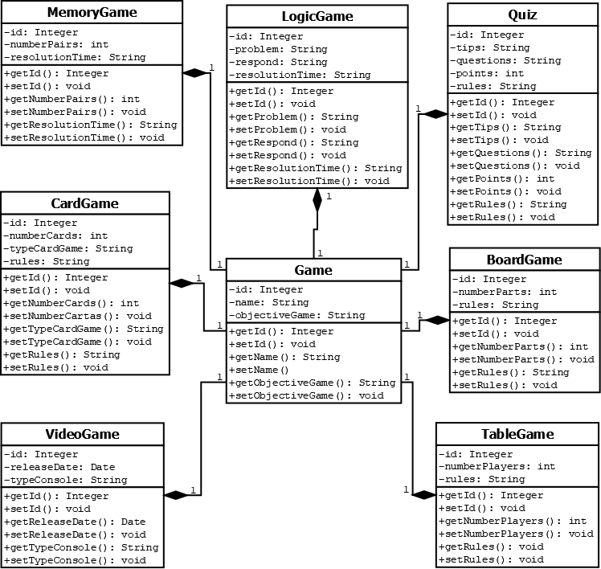

# Projeto em Spring Boot
<h3 text-align: justify;>
    O projeto apresenta uma solução para um sistema no qual é necessário categorizar, separar e armazena em um banco de dados informações referentes a jogos. O projeto categoriza 7 tipos de Jogos e define como deve ser feito o armazenamento dos seus dados.
</h3>
 
Categorias:
<ul>
  <li>Board Game</li>
  <li>Card Game</li>
  <li>Quiz</li>
  <li>Logic Game</li>
  <li>Memory Game</li>
  <li>Table Game</li>
  <li>Video Game</li>
</ul>

<h3>Para um melhor entendimento segue o Diagrama de Classes do Projeto: </h3>
 

  

